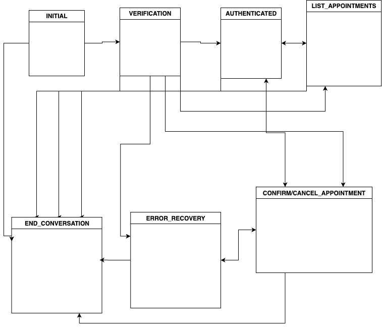

# Appointment Management Agent

This is a chat agent that can list, confirm, or cancel appointments.

## Running the Agent

The chat can currently be run in the `test_agent.py` file. After a language model and the `HealthcareConversationAgent` are initialized,
the user interact through a `while True` loop. The loop returns the new state of the conversation, including the AI's new responses in the
chat history.

The chat can also be run as a server in `server.py` from the `/chat` endpoint. To run locally,
run `uvicorn server:app --reload`. Then make requests containing a user_id and message to the `/chat` endpoint.
Example Request:

```
curl -X POST http://localhost:8000/chat \
  -H "Content-Type: application/json" \
  -d '{"user_id": "alice", "message": "Hi how are you"}'
```

Response:

```json
{
  "user_id": "alice",
  "ai_messages": [
    "Hi! I'm here to help you with your healthcare appointments. You can ask me to list, confirm, or cancel your appointments. To get started, I'll need to verify your identity for security purposes. Could you please provide your full name, phone number, and date of birth?"
  ],
  "state": "verification",
  "end": false
}
```

## Storage of User Data

Currently user data is hard-coded in memory.

## Overview of Design

The chat is designed as a state-machine using LangGraph containing 7 nodes:

```python
class ConversationStates(str, Enum):
    INITIAL = "initial"
    VERIFICATION = "verification"
    AUTHENTICATED = "authenticated"
    LIST_APPOINTMENTS = "list_appointments"
    CONFIRM_APPOINTMENT = "confirm_appointment"
    CANCEL_APPOINTMENT = "cancel_appointment"
    ERROR_RECOVERY = "error_recovery"
    END_CONVERSATION = "end_conversation"
```

Each node has a corresponding handler function that updates the state of the conversation:

```python
class ConversationState(TypedDict):
    """Complete conversation state with all necessary tracking"""
    messages: Annotated[List[BaseMessage], "conversation history"]
    current_state: ConversationStates
    verified: bool
    patient_id: Optional[str]
    verification_attempts: int
    verification_data: Dict[str, Optional[str]]  # collected verification info
    pending_action: Optional[str]
    selected_appointment_id: Optional[str] # Use later for confirming before confirm/cancel
    appointments: List[Dict[str, Any]]
    last_error: Optional[str]
    session_metadata: Dict[str, Any]
```

To access and modify data to verify the user and perform actions, the chat uses tools in `tools.py` which in turn
call services in `services.py`.

## Agent Class

The chat and state machine flow are managed within the HealthcareConversationAgent class in `healthcare_agent.py`.

This class passes state around to each handler function and back to the user. Handler
functions have full control over the routing by setting "current_state" to the next state
based on it's handling of user input.

Here is an outline of the intended state machine (currently verification node cannot flow directly to list/confirm/cancel nodes):



## Technologies

- Langchain
- LangGraph
- Groq
- OpenAI

## Notes

Upgrading from groq to openai's gpt-4.1 improved the chat's handling of instructions and user input, leading me to
rely more on it than manual parsing of the user's input.

- Re-using smaller prompt chunks in handlers:
  It may have been beneficial to come up with prompts for each action a user would want to take in any state of the chat, then extract these desired actions. For example, at any point a user might want to just exit the chat. In the current implementation, the agent must be prompted in every single state to determine if the user wants to exit the chat.

- Same is true for determining pending actions
